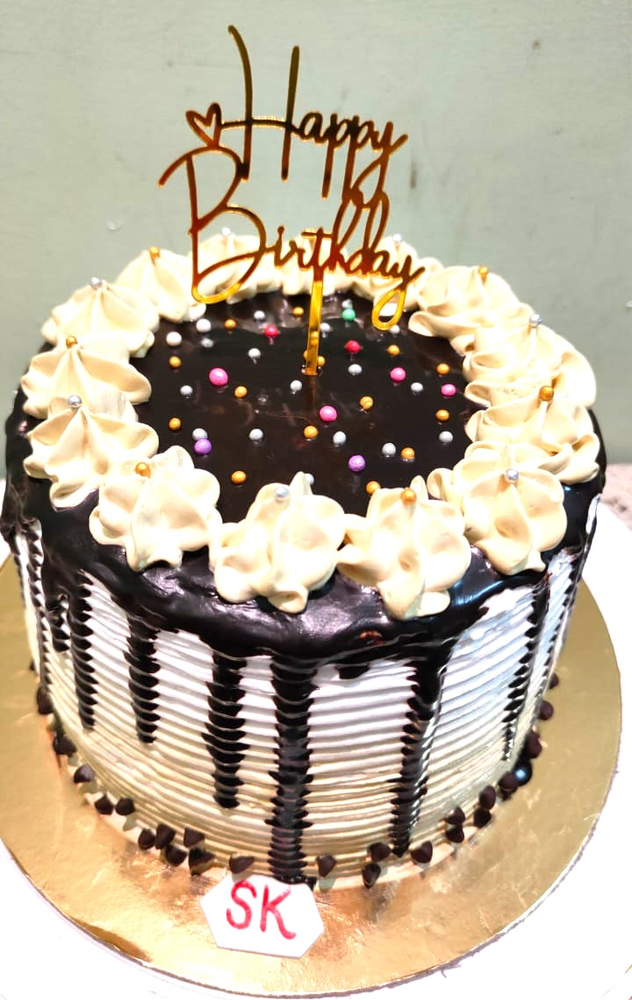

# Shades of Cake

Welcome to Shades of Cake, where we explore the many flavors and colors of cakes! My name is [Your Name], and I'm a passionate baker who loves experimenting with different cake recipes and decorations.

On this page, I'll be sharing some of my favorite cake recipes, as well as tips and tricks for baking and decorating cakes. Whether you're an experienced baker or a newbie in the kitchen, I hope you'll find something here that inspires you to create your own sweet masterpieces.

## About Me

I've always had a sweet tooth and a love for baking, but it wasn't until a few years ago that I really started to dive into the world of cake baking. Since then, I've experimented with all kinds of flavors and styles, from classic chocolate cakes to exotic fruit-filled cakes.

One of my favorite things about baking cakes is the creative aspect - I love trying out new designs and decorations, and seeing how they turn out. Some of my favorite decorations include fresh flowers, edible gold leaf, and colorful sprinkles.

Aside from baking, I enjoy reading, hiking, and spending time with my family and pets. I'm also a huge fan of coffee, and I love trying out new coffee shops and roasts.

## Some of My Favorite Cake Recipes

- Classic Chocolate Cake: This is a tried-and-true recipe that never fails to please. The key is using high-quality cocoa powder and real butter for a rich, chocolatey flavor.

- Lemon Blueberry Cake: This cake is perfect for spring and summer, with its bright, citrusy flavor and juicy blueberries. I like to decorate it with a simple lemon glaze and fresh blueberries on top.
- Red Velvet Cake: This classic cake is always a crowd-pleaser, with its deep red color and creamy frosting. I like to add a little bit of espresso powder to the batter to give it an extra kick of flavor.
- Carrot Cake: This is a healthier option that's still deliciously sweet and satisfying. I use whole wheat flour and coconut oil instead of butter, and add in shredded carrots and walnuts for some texture.

I hope this gives you a taste of what Shades of Cake is all about. Happy baking!
